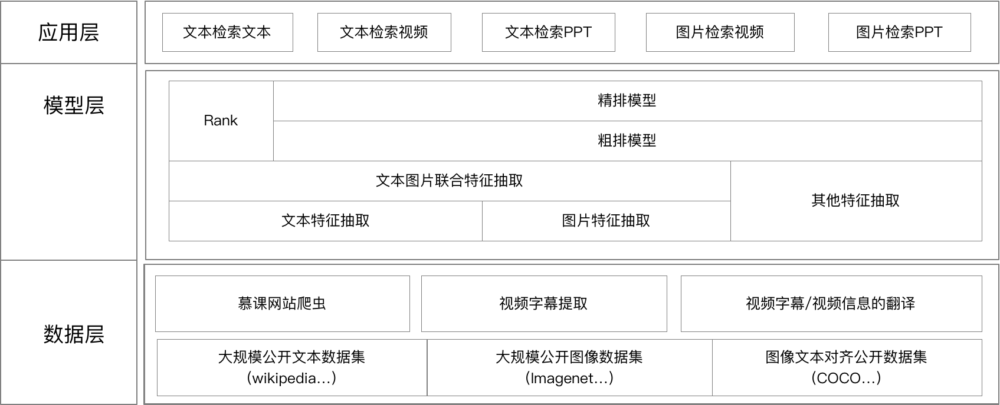

<h1 align="center">Cross-Modal-Search-Engine</h1>
<p align="center">从0到1，构建跨模态搜索引擎！</p>

<p align="center">
  <a href="https://github.com/BIT-IR/final-project-2019/stargazers">
    
  </a>
  <a href="https://github.com/BIT-IR/final-project-2019/issues">
        
  </a>
  <a href="https://github.com/BIT-IR/final-project-2019/">
        
  </a>
  <a href="https://github.com/BIT-IR/final-project-2019/blob/master/LICENSE">
        
  </a>
</p>


<h2 align="center">简介</h2>
我们将基于mooc场景，搭建一个深度理解视频，文本，PPT内容的跨模态搜索引擎。

**直接搜索到，你最关心的那个知识点！**




<h2 align="center">模块列表</h2>

### 1. 慕课网站爬虫模块

#### 作业内容
- 抓取的站点: Coursera,edX,Udacity,中国大学MOOC（任选一个）
- 抓取的信息:
  1. 课程基本信息:开课学校，主讲老师，课程简介，课程主页URL
  2. 每节课:单次课URL，视频，字幕，课程说明，单次课材料（PPT/pdf）

#### 提交内容
- 已经爬好的10门课程的全部课程内容（mp4 + srt +  pdf + json ）
- 爬虫系统
  ```
  输入: 课程的URL与存储路径，比如：https://www.coursera.org/learn/machine-learning
  输出: 课程的全部内容(mp4 + srt + pdf + json)
  ```
- 系统说明书

  
### 2. 视频字幕提取与翻译模块

#### 作业内容
- 给定视频文件，生成字幕文件（srt）
- 对视频字幕与课程信息的翻译（英文 -> 中文）

#### 提交内容
- 视频字幕提取系统
  ```
  输入: 单个视频
  输出: 视频的字幕文件
  ```
  
- 文本翻译系统
  ```
  输入: 英文的txt文件
  输出: 中文的txt文件
  ```
- 系统说明书


### 3. 文本检索文本模块

#### 作业内容
- 根据文本，在大规模语料中快速检索出相似的句子
- 基于粗排模型，召回一批句子
- 基于精排模型，准确找出相似的句子

#### 提交内容
- 文本检索文本系统
  ```
  输入: 文本query + 句子的集合
  输出: 指定时间内，存在结果，输出相匹配的句子
  ```

- 系统说明书


### 4. 文本检索视频模块

#### 作业内容
- 根据query文本，定位到视频中某一帧
- 根据Coco等数据集的特点，从YouTube上下载可用的视频文件

#### 提交内容
- 文本检索视频系统
  ```
  输入: 文本query + 多个视频
  输出: 如果存在结果，输出指定视频编号+定位的秒
  ```
- 系统说明书

### 5. 文本检索PPT模块

#### 作业内容
- 根据query文本，定位到PPT的某一页
- 基于[PPT分享网站](https://www.slideshare.net)构建PPT数据集

#### 提交内容
- 文本检索PPT系统
  ```
  输入: 文本query + 多个PPT文件
  输出: 如果存在结果，输出指定PPT文件，以及该PPT文件的第几页
  ```
- 系统说明书


### 6. 图片检索视频模块

#### 作业内容
- 根据query图片，快速定位到视频中某一帧

#### 提交内容
- 图片检索图片系统
  ```
  输入: 图片 + 视频的集合
  输出: 如果存在结果，输出相匹配的图片
  ```
- 系统说明书


### 7. 图片检索PPT模块

#### 作业内容
- 根据图片，从多个PPT文件中快速检索出相似的图片
- 基于[PPT分享网站](https://www.slideshare.net)构建PPT数据集


#### 提交内容
- 图片检索图片系统
  ```
  输入: 图片 + 多个PPT文件
  输出: 如果存在结果，输出指定PPT文件，以及该PPT文件的第几页
  ```
- 系统说明书


<h2 align="center">其他说明</h2>

- 分组说明：每组不超过5个人，自由组队，选出组长。
- 选题说明：请组长尽快在群里说明分组情况，以及选题，每个模块不超过3个小组，先到先得！
- 代码规范:
  1. 全部代码基于Python3.6实现
  2. 代码遵守[Google代码规范](https://zh-google-styleguide.readthedocs.io/en/latest/google-python-styleguide/python_style_rules/)
  3. 代码需要有规范的注释，遵循[注释规范](https://python-guide.gitbooks.io/python-style-guide/content/style-guide/comment_and_docs.html)
  4. 系统需要在Ubuntu 16.04环境下可以运行，文档需要注明系统的依赖

<h2 align="center">参考内容</h2>

- requests / xpath / re / scrapy
- selenium + Chrome
- OCR / Speech to Text
- [TensorFlow Neural Machine Translation Tutorial](https://github.com/tensorflow/nmt)
- Elesticsearch 
- Annoy: Approximate Nearest Neighbors in C++/Python optimized for memory usage
- Pre-Train NLP Model: ELMO / BERT 
- Pre-Train CV Model: Resnet / VGG
- [Cross-Modal Learning in Real World](https://cromol.github.io/)

**GOOGLE IS ALL YOU NEED**

<h2 align="center">分组汇总</h2>

<table align="center">
    <tr>
        <td align="center"><b>模块</b></td>
        <td align="center"><b>分组</b></td>
    </tr>
    <tr>
      <td rowspan="3" align="center">慕课网站爬虫模块</td>
      <td>王佳佳，汪舰，王维，王浚宇</td>
    </tr>
    <tr>
      <td>李东，李世林，谢斌辉，彭成</td>
    </tr>
    <tr>
      <td>唐汉霖，毛宏力，姜程镨，邵靖斐，赵菊文</td>
    </tr>
    <tr>
        <td rowspan="3" align="center">视频字幕提取与翻译模块</td>
        <td>徐恒达，郭佳楠，柏宇，林书阳，辛成鑫</td>
    </tr>
    <tr>
        <td>陈牧乔，付乐萌，徐逍君，孙今达</td>
    </tr>
    <tr>
        <td>赖一多，于扬，郭振宇，王艳平，李丽丽</td>
    </tr>
    <tr>
        <td rowspan="3" align="center">文本检索文本模块</td>
        <td>张思嘉，程浩东，李敏琴，殷昕，朱乐</td>
    </tr>
    <tr>
        <td>陈秀琦，钟子岳，及朋飞，马思怡</td>
    </tr>
    <tr>
        <td>张辰，曹健，展佳傲，杜建成，陆旭阳</td>
    </tr>
    <tr>
        <td rowspan="2" align="center">文本检索视频模块</td>
        <td>刘曦，焦青青，吴楠楠，辛永顺</td>
    </tr>
    <tr>
        <td>何龙，郑俊康，佘宇峰，薛晓军，周泳宇</td>
    </tr>
    <tr>
        <td rowspan="3" align="center">文本检索PPT模块</td>
        <td>王蔚然，冯姝榕，黄云飞，王元杰，赵培雯</td>
    </tr>
    <tr>
        <td>李佳钰，徐兰天，王文琪，刘龙耀</td>
    </tr>
    <tr>
        <td>任泽槟，陈立围，王海，费伟伦</td>
    </tr>
    <tr>
        <td rowspan="1" align="center">图片检索视频模块</td>
        <td>李彤，东辉，邵江逸，秦肖睿，宫佳豪</td>
    </tr>
    <tr>
        <td rowspan="2" align="center">图片检索PPT模块</td>
        <td>耿坤男，吴昊，苏静宇，孙佩霞</td>
    </tr>
    <tr>
        <td>戴子彭，赵一诺，高硕，葛晶，苏丽敏</td>
    </tr>
</table>


<h2 align="center">FAQs</h2>

#### Q: 检索模块自己构建数据集吗？还是等待爬虫模块的同学完成？
A: 每个小组都需要自己构建数据集；爬虫模块是跟其他小组完全独立的一项工作。
